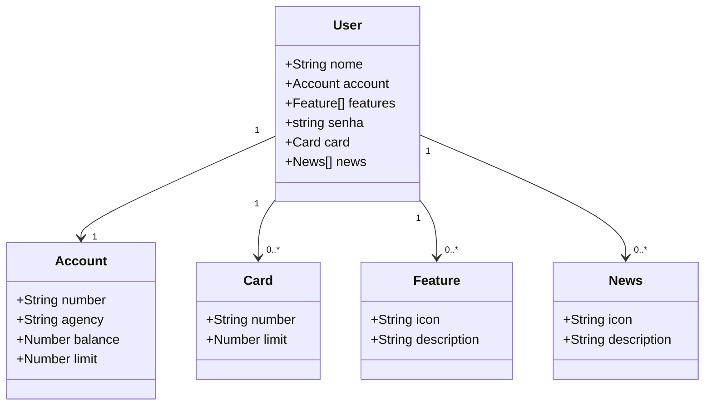

```mermaid

classDiagram
    class User {
        +String nome
        +Account account
        +Feature[] features
        +string senha
        +Card card
        +News[] news
    }

    class Account {
        +String number
        +String agency
        +Number balance
        +Number limit
    }

    class Card {
        +String number
        +Number limit
    }

    class Feature {
        +String icon
        +String description

    }

    class News {
        +String icon
        +String description
    
    }

    User "1" --> "1" Account 
    User "1" --> "0..*" Card 
    User "1" --> "0..*" Feature 
    User "1" --> "0..*" News 


```
